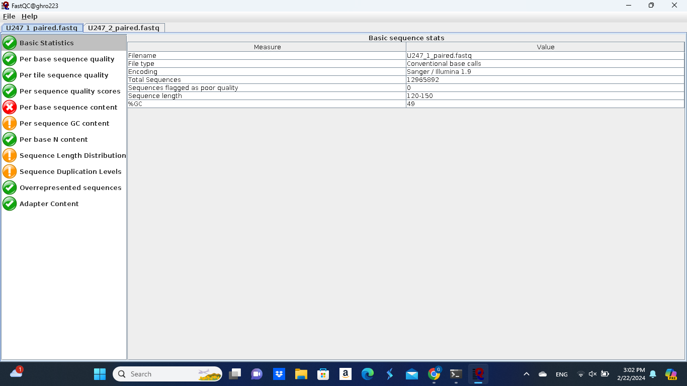
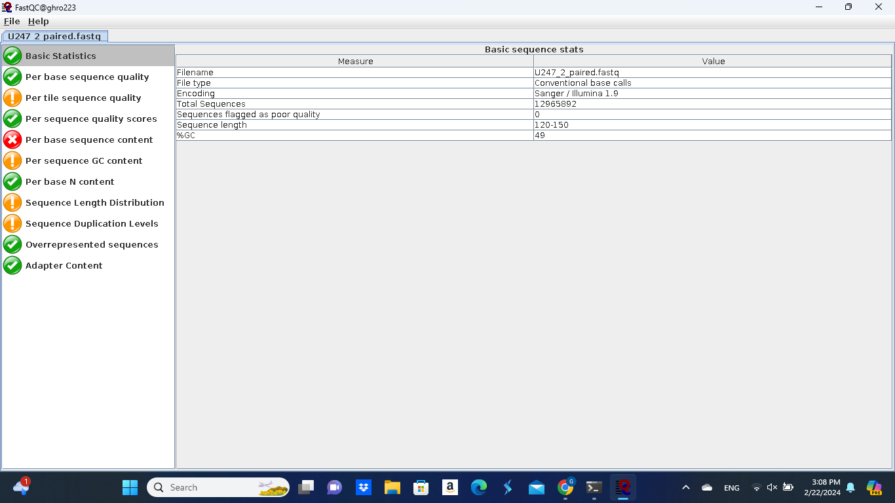

# MyGenome
Analyses for ABT480/CS485G genome assembly

## 1. Analysis of sequence quality
The F1 and R1 sequence data sets were analyzed using FASTQC:
```bash
ssh -Y ghro223@ghro223.cs.uky.edu
cd MyGenome
fastqc&
```
Load F1 and R1 data into GUI interface.
Take screen shots of output files: 




## 2. Assembly using MCC
Logging into MCC and scp sequence data
```bash
ssh ghro223@mc.uky.edu
cd..
cd..
cd project/farman_s24cs485g/
mkdir ghro223
cd ghro223
scp ghro223@ghro223.cs.uky.edu:/home/ghro223/MyGenome/U247_1_paired.fastq .
scp ghro223@ghro223.cs.uky.edu:/home/ghro223/MyGenome/U247_1_unpaired.fastq .
scp ghro223@ghro223.cs.uky.edu:/home/ghro223/MyGenome/U247_2_paired.fastq .
scp ghro223@ghro223.cs.uky.edu:/home/ghro223/MyGenome/U247_2_unpaired.fastq .
cp ../SLURM_SCRIPTS/velvetoptimiser_noclean.sh .
vim velvetoptimiser_noclean.sh
```
I then altered the velvetoptimiser_noclean.sh script to include my email and some new header data, and then went on to run the velvetoptimiser_noclean.sh with a step size of 10
```bash
sbatch velvetoptimiser_noclean.sh U247 61 131 10
```
After the run was complete, I analyzed the new assembly data via command
```bash
tail -50 U247/velvet_U247_61_131_10_noclean/19-03-2024-15-01-19_Logfile.txt
``` 
.png) 
I then went on to run the velvetoptimiser_noclean.sh script with a step size of 2
```bash
sbatch velvetoptimiser_noclean.sh U247 110 130 2
```
After the run was complete, I analyzed the new assembly data via command
```bash
tail -50 U247/velvet_U247_110_130_2_noclean/21-03-2024-14-41-21_Logfile.txt
```
.png)
## 3. Blasting my Genome
Inside of my blast directory on my VM I ran the following
```bash
blastn -subject U247.fasta-query MoRepeats.fasta -out MoRepeats.U247.BLASTn0 -evalue 1e-20 -outfmt 0
blastn -subject U247.fasta-query MoRepeats.fasta -out MoRepeats.U247.BLASTn1 -evalue 1e-20 -outfmt 1
blastn -subject U247.fasta-query MoRepeats.fasta -out MoRepeats.U247.BLASTn2 -evalue 1e-20 -outfmt 2
blastn -subject U247.fasta-query MoRepeats.fasta -out MoRepeats.U247.BLASTn3 -evalue 1e-20 -outfmt 3
blastn -subject U247.fasta-query MoRepeats.fasta -out MoRepeats.U247.BLASTn4 -evalue 1e-20 -outfmt 4
blastn -subject U247.fasta-query MoRepeats.fasta -out MoRepeats.U247.BLASTn5 -evalue 1e-20 -outfmt 5
blastn -subject U247.fasta-query MoRepeats.fasta -out MoRepeats.U247.BLASTn6 -evalue 1e-20 -outfmt 6
blastn -subject U247.fasta-query MoRepeats.fasta -out MoRepeats.U247.BLASTn7 -evalue 1e-20 -outfmt 7
blastn -subject U247.fasta-query MoRepeats.fasta -out MoRepeats.U247.BLASTn8 -evalue 1e-20 -outfmt 8
blastn -subject U247.fasta-query MoRepeats.fasta -out MoRepeats.U247.BLASTn9 -evalue 1e-20 -outfmt 9
blastn -subject U247.fasta-query MoRepeats.fasta -out MoRepeats.U247.BLASTn10 -evalue 1e-20 -outfmt 10
blastn -subject U247.fasta-query MoRepeats.fasta -out MoRepeats.U247.BLASTn11 -evalue 1e-20 -outfmt 11
```
I then used scp to transfer SequenceLengths.pl from the farman lab computer desktop to my VM and ran the following in my blast directory
```bash
perl SequenceLengths.pl U247.fasta | sort -k2n
```
.png)
From this I learned that my longest contig was U247_contig2655.
I then ran the following on my n6 output in an attempt to see if my genome contained any MAGGY gene
```bash
grep MAGGY MoRepeats.U247.BLASTn6
```
And did not get any matches, I then ran the same but with the Pot2 gene
```bash
grep Pot2 MoRepeats.U247.BLASTn6
grep Pot2 MoRepeats.U247.BLASTn6 | wc -l
```
And got 85 matches
.png)
I then ran the following because of the assignment and yielded no output
```blast
grep Pot2 MoRepeats.U247.BLASTn6 | awk '$4 >= 5638*0.9'
grep Pot2 MoRepeats.U247.BLASTn6 | awk '$2 ~ /contig2655/' | awk '$9 > 2000000 && $9 < 3000000' | sort -k9n
